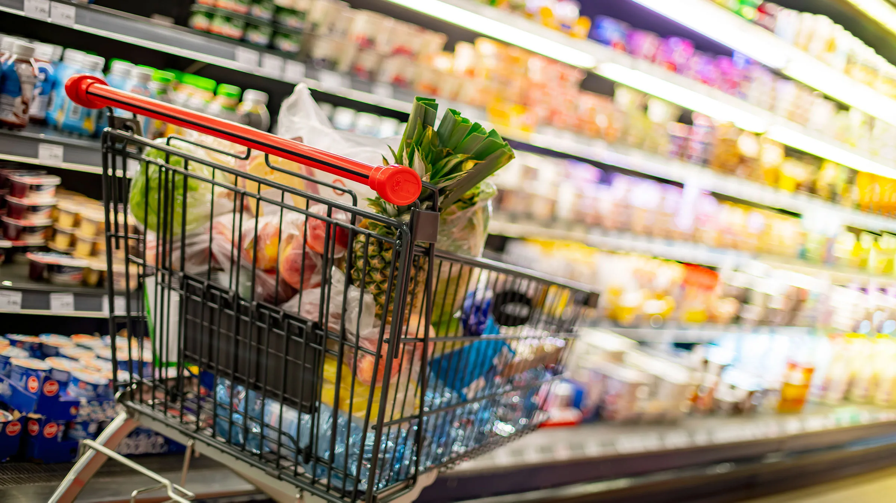

# Supermarkets Dia and Mercadona
---

---
# Introduction
Dia and Mercadona are both very important supermarkets in Spain, as any supermarket, they have a large amount of products and sections, splited by categories and subcategories. Most people make their basic and not that basic purchases on that kind of supermarkets, so I wanted to to analize those products and supermarkets to finaly get some kind of revelations 🙌🙌.

---
# Objetives

- This is my first project during [IronHack](https://www.ironhack.com/es) Data Analytics bootcamp, so many things still need a bit of polishment.
- One basic target is to start with a dataset and clean it.
- Another requirement it's to scrap adicional data and enrich our main dataset.
- Also, we need to make a DataBase, I did it on [MySQL](https://www.mysql.com/).
- And lastly, we had to make some basic visualizations and get our conclusions.
---
# Data

- My starting dataset it's a very well know dataset about supermarkets, a sort version can be found on [kaggle](https://www.kaggle.com/datasets/datamarket/productos-de-supermercados).
- Adicional data was taken from [Mercadona](https://tienda.mercadona.es/) and [Dia](https://www.dia.es/compra-online/), I had to use Selenium to scrap Mercadona's data and BeautifulSoup to scrap Dia's data.
- I made my own data pipeline in order to clean and manipulate all the data, also a library that is used by the functions on my pipeline, all this can be found in [src](https://github.com/XiangLinZ/Proyecto_1_ETL/tree/main/src) folder.
- Also, I'm so sorry if there is some titles and variables in Spanish...
didn't though that i had to translate everything to English, so if there is something that isn't translated fell free to ask me! 👍👍.
---
# Conclusion
- The section where you gonna find more variety it's personal care and hygiene, another important section are eggs and milk derivations followed by pantry products, drinks and alcoholic driks are also important.

- Another interesting fact it's that all the basic products has increase their average price.
- For more in deep analysis click [here](https://github.com/XiangLinZ/Proyecto_1_ETL/blob/main/analysis/analysis_figures.md).
---
# Tools
I had to use a variety of tools in this project for diverse pourposes they are listed here, with a small description of them.
- [Numpy](https://numpy.org/): A fundamental and basic package for scientific computing with Python.
- [Pandas](https://pandas.pydata.org/): Open source data analysis and manipulation tool.
- [Datetime](https://docs.python.org/3/library/datetime.html): The datetime module supplies classes for manipulating dates and times.
- [Pickle](https://docs.python.org/3/library/pickle.html): This module implements binary protocols for serializing and de-serializing a Python object structure.
- [Request](https://pypi.org/project/requests/): Requests is a simple, yet elegant, HTTP library.
- [BeautifulSoup](https://www.crummy.com/software/BeautifulSoup/bs4/doc/): Beautiful Soup is a Python library for pulling data out of HTML and XML files.
- [Selenium](https://www.selenium.dev/): Selenium automates browsers. Primarily it is for automating web applications for testing purposes, but is certainly not limited to just that.
- [SQLalchemy](https://www.sqlalchemy.org/):  It's the Python SQL toolkit and Object Relational Mapper that gives application developers the full power and flexibility of SQL.
- [Getpass](https://docs.python.org/es/3.9/library/getpass.html): getpass prompts the user for a password without echoing. The getpass module provides a secure way to handle the password prompts where programs interact with the users via the terminal.
- [Matplotlib](https://matplotlib.org/): Matplotlib is a comprehensive library for creating static, animated, and interactive visualizations in Python.
- [Seaborn](https://seaborn.pydata.org/): Seaborn is a Python data visualization library based on matplotlib.
- [Plotly](https://plotly.com/): Dash Enterprise is the premier platform for
building, scaling, and deploying data apps in Python.
- [Squarify](https://github.com/laserson/squarify): Pure Python implementation of the squarify treemap layout algorithm.
- [fuzzywuzzy](https://pypi.org/project/fuzzywuzzy/): Fuzzy string matching like a boss. It uses Levenshtein Distance to calculate the differences between sequences in a simple-to-use package.