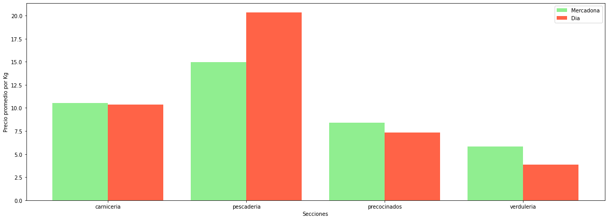

# Mercadona's product distribution
---
I wanted to know the distribution of the products of Mercadona, on my first though I believed that the bigger section gonna be something related to food.

- As we can see on the table, the most important section, at least with the most variety of products it's about personal care and hygiene, that's quite interesting, since eggs and milk derivations with pantry products are also important.
- We can see that drinks and alcoholic drinks are also an important part of the supermarket.
- And the butchering section is decent, but on the other site, fish shop and greengrocery doesn't have that mutch variety, that's and interesting point.

# Basic products price evolution
---
Another important thing for the population is that there is some basic products that most of the people needs,
I wanted to see the evolution of the average price of that kind of products.

- This figure show us a quite interesting informatio, as we can see price has grown, but not that much in general.
- But there is a significant increase on 2023 year, could it be a sign of a crisis aproach?
- Alse we can see an increase on cereals and oil on 03-22, that could be because of the recent war between Rusia and Ukraine

# Price evolution of supermarkets
---
Now that we know the general price evolution of some basics, analyce the price evolution of the supermarkets could be interesting.

- As we can see there is some interesting info here, we can see that in general the average prices get lower and lower that could because supermarket tent to make their own brand, so they don't need to pay that much loyalty and also gets a better profit ratio, so they can make products cheaper, also, this could happen because they offer more cheaper options and remove products that are a bit more expensive.
- by the other hand we can see some significant changes on Dia's supermarket, prices got lower but had a significant increase on 11-22, this could be because Dia on holidays dates use more brand products also the reason could be changes on the main directors that Dia had on the last years.

# Supermarkets with lower prices on main sections
---
I also wanted to compare Dia and Mercadona, to see which one has the most sections with lower average price.

- As we can see, Mercadona has more sections that dia with lower average prices, that means that if you are going to make a general purchase between those two supermarkets, you gonna buy more things in mercadona that if you would expend your money in Dia

# Main sections comparation
---
Now, let's comparate the main sections of the supermarkets in terms of alimentation.

- That info is impresive, we can see that in general Dia has a cheaper price on fresh products than Mercadona, but has higher prices on the fish shop section, this could mean better quality or worst logistics, further investigation is needed.
- On the other hand we can see that precook food is not that expensive, buying enterily meat and fish will be much expensive, and the greengrocery is quite cheat.
- By far the fish shop is the most expensive section.

# Alcoholic Drinks' price evolution
---
Let's be realistics, this sections it's one of the most important, and everybody has diferent taste, so lets analyze the price by categories.

- As we can see price didn't changed that much, inf fact, we can see again an impresive increase on the year 2023
- Prices in general are steady but beer had a significan increase on 07-22, that increase has two reasons, one is the ukraine war, ukraine was one of the main exporter of barley, and also there was a problem with the green glass used to bottling the beer.
- Another interesting information is that destilate and liqueur are not that steady and also has a greater increase on prices comparate with the rest of the products. Also, by far it's most expensive.

# Beer Price distribution
---
I love beer, not gonna lie, so I want to know the distribution of the prices of each beer that I have in this database, to know when I'm buying some beer if that worth or not that much his prices comparating his flavour.

- As we can see, most os the beer are situated between 2 and 3 euros per litre.
- There is also a few that are situated on the 19-20 section.
- And we can see that there is also a lot of beers that are distributed around our main prices of 2/3 euros

## Thank you for reading my project and also, I'm sorry because my figures and graphics are mostly on Spanish, also I know that there is much to improve and I'll try to keep working on this small project on my free time, also feel free to coment and give suggestions!!! 😀😀😀